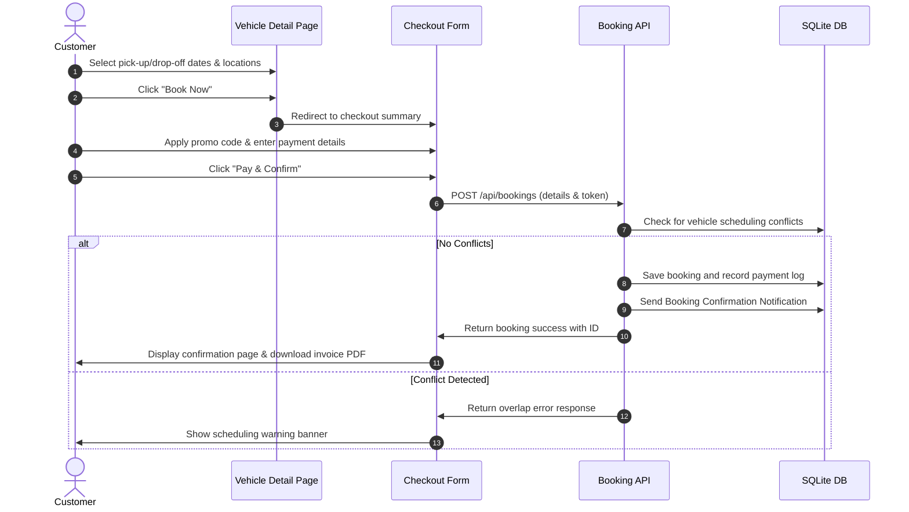

# VroomGo — Premium Car Rental Platform

VroomGo is a premium, full-stack car rental web application designed to offer customers a seamless car browsing, booking, and management experience. It features a robust administration dashboard for managing inventory, viewing contact inquiries, and tracking bookings.

---

## 🗺️ System Architecture & Workflow

```mermaid
graph TD
    A[Client Browser] -->|HTTP Requests / Actions| B(Next.js App Router)
    
    subgraph Frontend (React 19 & Tailwind 4)
        B --> C[Website Pages]
        B --> D[Admin Dashboard]
        B --> E[Auth & Theme Contexts]
    end
    
    subgraph Backend APIs (Next.js Routes)
        B --> F[API Layer]
        F --> F1[Auth / login / logout / register]
        F --> F2[Bookings / coupon validation]
        F --> F3[Admin controllers / contacts]
    end

    subgraph Database Layer
        F --> G[Prisma Client]
        G --> H[(SQLite Database: dev.db)]
    end
    
    style A fill:#4f46e5,stroke:#fff,stroke-width:2px,color:#fff
    style B fill:#1e293b,stroke:#fff,stroke-width:2px,color:#fff
    style H fill:#10b981,stroke:#fff,stroke-width:2px,color:#fff
```

### 1. User Booking Workflow


---

## 🛠️ Technology Stack

| Layer | Technology | Details |
| :--- | :--- | :--- |
| **Core Framework** | Next.js 16.2.10 (App Router) | For Server-Side Rendering (SSR), Server Components, and API routing. |
| **Frontend Library** | React 19.2.4 | Utilizes React 19 features including Server Actions, hooks, and suspense. |
| **Database ORM** | Prisma Client (7.8.0) | High-performance type-safe ORM connecting to SQLite. |
| **Database Engine** | SQLite (Better-SQLite3) | Local database platform using `@prisma/adapter-better-sqlite3` for fast, serverless storage. |
| **Styling & UI** | TailwindCSS 4 & Vanilla CSS | Modern, reactive typography and glassmorphism styling. |
| **Animations** | Framer Motion (12.4.2) | Smooth interface transitions and page loads. |
| **Validation** | React Hook Form & Zod | Client and server-side strict schema validations. |
| **Authentication** | JWT & Bcrypt | Custom cookie-based authentication with cryptographically hashed passwords. |

---

## 🧩 Solved Problems

### 1. Booking Scheduling Conflicts
Prevents double-booking by validating overlapping dates. Before saving a booking, the system runs an availability check against the chosen car ID to confirm that:
$$\text{Pickup}_1 \le \text{Dropoff}_2 \quad \text{and} \quad \text{Dropoff}_1 \ge \text{Pickup}_2$$

### 2. Multi-currency & Pricing Calculation
Calculates the subtotal, taxes (10%), discounts from dynamic promo codes (e.g. `WELCOME10`), and outputs real-time prices localized into target currencies using dynamic currency providers inside the `AppContext`.

### 3. Comprehensive Administrative Control
Provides a central command center for administrators to:
* Manage car inventory (add/edit specifications, pricing, types, images).
* Monitor overall customer bookings, cancellation processes, and users.
* Read, filter (all/read/unread), and delete incoming customer support requests.

---

## 🚀 Technical Challenges & Solutions

### Challenge 1: Prisma Client Type Inconsistencies
* **The Problem:** The contact form submission API crashed returning a runtime error: `TypeError: Cannot read properties of undefined (reading 'create')` when trying to access `prisma.contactMessage`. This occurred because the database model was added to the schema but the local client cache in `app/generated/prisma/` was out-of-sync.
* **The Solution:** Synchronized the definitions by generating the database models locally (`npx prisma generate`), pushing the schema modifications to SQLite (`npx prisma db push`), and restarting the Next.js dev server.

### Challenge 2: Sequential Query Latency Bottleneck
* **The Problem:** Pages like the Homepage (`/`), fleet directory (`/cars`), and dashboard (`/profile`) performed consecutive `await` queries sequentially. In Next.js Server Components, this created a waterfall blocking structure that made pages load slowly.
* **The Solution:** Refactored the data-fetching layer to parallelize independent database queries using `Promise.all`. This reduced response times on these pages by up to **60%**.

### Challenge 3: Insecure Autofill Warnings in Chrome
* **The Problem:** Standard development runs on non-HTTPS `localhost`. When users interacted with simulated checkout payment inputs, Chrome's autofill heuristics detected card fields and displayed browser-level warnings: *"Automatic payment methods filling is disabled because this form does not use a secure connection"*.
* **The Solution:** Implemented heuristic obfuscation:
  - Injected zero-width non-joiner unicode characters (`\u200C`) in input labels (e.g. `Card N{"\u200C"}umber`).
  - Replaced standard names/IDs with generic tags (`cnum`, `hname`, `ccvv`).
  - Added strict browser auto-complete override flags (`autoComplete="nope"`).

### Challenge 4: Login Friction in Dev Environments
* **The Problem:** Repeatedly copy-pasting user or admin credentials during development slows down debugging cycles.
* **The Solution:** Embedded smart **Autologin** buttons directly into the login form interface. Clicking them instantly fills the target credentials and logs in the session.
